# Music Streaming Platform

## Description
A music streaming system that allows users to stream and manage their favorite songs online using an SQL-based database management system.

### Overview
This system involves building a scalable database that supports song classification, playlist management, and subscription services. It enables users to browse and stream music, make and edit playlists, and effectively manage their subscription plans, hence providing the best possible user experience.

### Rationale
This stems from the demand for personalized music experiences and effective data management in the streaming sector serves as the project's justification. Designing a database system with high performance, accurate, and user-focused features becomes essential as music libraries continue to grow. This system therefore seeks to meet these demands in order to improve user satisfaction and efficient data organization in music streaming services.

### Objectives
- Create and implement a database system that can handle large amounts of data, such as user data, playlists, music, and subscription information.
- Guarantee that the platform offers necessary features like song categorizing, playlist construction, and subscription tracking.
- Improve user experience by personalizing recommendations.
- Demonstrate how database systems can be practically used to address actual problems in the music streaming sector.

## Table of Contents
- [Description](#description)
- [Installation](#installation)
- [Database Schema](#database-schema)
- [Usage](#usage)
- [Contributing](#contributing)
- [Contact](#contact)
- [Acknowledgments](#acknowledgments)

## Installation

### Prerequisites
- MySQL Server
- MySQL Workbench

### Steps
```bash
# Clone the repository
git clone https://github.com/otieno-calvin/music-streaming-system.git

# Navigate to the project directory
cd music-streaming-system

# Import the SQL file to set up the database
mysql -u username -p password < path/to/yourfile.sql
```
## Database Schema

### Entity-Relationship Diagram (ERD)

```mermaid
erDiagram
    USERS {
        INT user_id PK
        VARCHAR username
        VARCHAR email
        VARCHAR password
        TIMESTAMP date_joined
    }
    ARTISTS {
        INT artist_id PK
        VARCHAR artist_name
        BOOLEAN is_band
        INT monthly_listeners
        VARCHAR country
    }
    SONGS {
        INT song_id PK
        VARCHAR title
        INT artist_id FK
        INT album_id FK
        VARCHAR genre
        INT duration
        DATE release_date
        INT track_number
        TEXT lyrics
        INT play_count
    }
    ALBUMS {
        INT album_id PK
        VARCHAR title
        INT artist_id FK
        DATE release_date
        INT total_tracks
        VARCHAR genre
    }
    PLAYLISTS {
        INT playlist_id PK
        VARCHAR name
        INT user_id FK
        TEXT description
        TIMESTAMP date_created
    }
    LIKES {
        INT user_id FK
        INT song_id FK
        TIMESTAMP date_added
    }
    RECOMMENDATIONS {
        INT recommendation_id PK
        INT user_id FK
        INT song_id FK
        VARCHAR recommendation_reason
        TIMESTAMP recommendation_date
    }
    LISTENING_HISTORY {
        INT history_id PK
        INT user_id FK
        INT song_id FK
        TIMESTAMP listen_time
        INT listen_duration
    }
    USER_SUBSCRIPTIONS {
        INT subscription_id PK
        INT user_id FK
        VARCHAR subscription_status
        INT plan_id FK
        DATE start_date
        DATE end_date
        VARCHAR payment_status
        TIMESTAMP created_at
        TIMESTAMP updated_at
    }
    SUBSCRIPTION_PLAN_FEATURES {
        INT plan_id PK
        VARCHAR plan_name
        INT feature_id FK
        FLOAT price
        INT duration_months
        TIMESTAMP created_at
        TIMESTAMP updated_at
    }
    PREMIUM_FEATURES {
        INT feature_id PK
        VARCHAR feature_name
        TEXT feature_description
        BOOLEAN is_active
        TIMESTAMP created_at
        TIMESTAMP updated_at
    }
    PAYMENTS {
        INT payment_id PK
        INT user_id FK
        INT plan_id FK
        FLOAT amount
        TIMESTAMP payment_date
        VARCHAR payment_method
        VARCHAR status
    }
    PLAYLIST_SONGS {
        INT playlist_id FK
        INT song_id FK
        TIMESTAMP date_added
    }
    USER_PAYMENT_HISTORY {
        INT user_id FK
        INT payment_id FK
    }
    USER_LISTENING_HISTORY {
        INT user_id FK
        INT history_id FK
    }
    SUBSCRIPTION_PLANS_WITH_FEATURES {
        INT plan_id FK
        INT feature_id FK
    }
    PLAYLIST_SONGS_VIEW {
        INT playlist_id FK
        INT song_id FK
    }
    USER_PROFILE {
        INT user_id FK
        INT song_id FK
    }
    USER_RECOMMENDATIONS {
        INT user_id FK
        INT recommendation_id FK
    }
    LIKED_SONGS {
        INT user_id FK
        INT song_id FK
    }
    SONG_DETAILS {
        INT song_id FK
        INT album_id FK
    }

    USERS ||--o{ PLAYLISTS : "has"
    USERS ||--o{ LIKES : "likes"
    USERS ||--o{ RECOMMENDATIONS : "receives"
    USERS ||--o{ LISTENING_HISTORY : "has"
    USERS ||--o{ USER_SUBSCRIPTIONS : "subscribes"
    USERS ||--o{ PAYMENTS : "makes"
    USERS ||--o{ USER_PAYMENT_HISTORY : "has"
    USERS ||--o{ USER_LISTENING_HISTORY : "has"
    USERS ||--o{ USER_PROFILE : "has"
    USERS ||--o{ USER_RECOMMENDATIONS : "receives"
    USERS ||--o{ LIKED_SONGS : "likes"
    ARTISTS ||--o{ SONGS : "creates"
    ARTISTS ||--o{ ALBUMS : "releases"
    SONGS ||--o{ LISTENING_HISTORY : "is listened"
    SONGS ||--o{ PLAYLIST_SONGS : "is in"
    SONGS ||--o{ SONG_DETAILS : "has"
    ALBUMS ||--o{ SONGS : "contains"
    PLAYLISTS ||--o{ PLAYLIST_SONGS : "contains"
    SUBSCRIPTION_PLAN_FEATURES ||--o{ USER_SUBSCRIPTIONS : "has"
    SUBSCRIPTION_PLAN_FEATURES ||--o{ SUBSCRIPTION_PLANS_WITH_FEATURES : "has"
    PREMIUM_FEATURES ||--o{ SUBSCRIPTION_PLAN_FEATURES : "has"
    PAYMENTS ||--o{ USER_PAYMENT_HISTORY : "has"
    PLAYLIST_SONGS ||--o{ PLAYLIST_SONGS_VIEW : "has"
```


## Usage

### How to Use
1. Register an account.
2. Browse and play songs.
3. Create and manage playlists.

## Demo Video
Check out our [demo video](https://drive.google.com/file/d/19FUiMgfi2lA4rfl4C1-k8AqEbEP6Hj-W/view?usp=drivesdk) to see the music streaming system in action!
Switch to 1080p for better viewing

<video width="720" height="240" controls> <source src="https://drive.google.com/file/d/19FUiMgfi2lA4rfl4C1-k8AqEbEP6Hj-W/view?usp=drivesdk" type="video/mp4"> </video>

### Example Queries
```sql
-- Fetch all songs by a specific artist
SELECT * FROM SONGS WHERE artist_id = 1;

-- Add a new song to the database
INSERT INTO SONGS (title, artist_id, album_id, genre, duration)
VALUES ('Song Title', 1, 2, 'Genre', '3:45');

```
## Contributing

### Guidelines

1.  Fork the repository
    
2.  Create a new branch (`git checkout -b feature/your-feature`)
    
3.  Commit your changes (`git commit -m 'Add some feature'`)
    
4.  Push to the branch (`git push origin feature/your-feature`)
    
5.  Open a Pull Request

## Contact

**Author**: [Otieno Calvin(Full -Stack) DS](https://github.com/Otieno-Calvin)

## Acknowledgments
    
-   Another Project for inspiration : [HATUCHELEWI MODEL](https://github.com/Otieno-Calvin/HATUCHELEWI-model/blob/master/LATE%20DELIVERY%20ANALYSIS.pdf)
    

## References

1.  Connolly, T., Begg, C., Database Systems: A Practical Approach to Design, Implementation, and Management. Pearson Education.
    
2.  Elmasri, R., Navathe, S., Fundamentals of Database Systems. Addison-Wesley.
    
3.  Tutorials Point, SQL Basics and Advanced Concepts.
## Appendices

### SQL Snippets for Music Streaming System

### Create Database and Tables

```sql
DROP DATABASE IF EXISTS msc;
CREATE DATABASE IF NOT EXISTS msc;
USE msc;

-- Users Table
CREATE TABLE IF NOT EXISTS Users (
    user_id INT PRIMARY KEY AUTO_INCREMENT,
    username VARCHAR(50) UNIQUE NOT NULL,
    email VARCHAR(100) UNIQUE NOT NULL,
    password VARCHAR(255) NOT NULL,
    date_joined TIMESTAMP DEFAULT CURRENT_TIMESTAMP
);

-- Artists Table
CREATE TABLE IF NOT EXISTS Artists (
    artist_id INT PRIMARY KEY AUTO_INCREMENT,
    artist_name VARCHAR(100) NOT NULL,
    bio TEXT,
    monthly_listeners INT DEFAULT 0,
    country VARCHAR(50)
);

-- Albums Table
CREATE TABLE IF NOT EXISTS Albums (
    album_id INT PRIMARY KEY AUTO_INCREMENT,
    title VARCHAR(100) NOT NULL,
    artist_id INT,
    release_date DATE,
    total_tracks INT,
    genre VARCHAR(100),
    FOREIGN KEY (artist_id) REFERENCES Artists(artist_id)
);

-- Songs Table
CREATE TABLE IF NOT EXISTS Songs (
    song_id INT PRIMARY KEY AUTO_INCREMENT,
    title VARCHAR(100) NOT NULL,
    artist_id INT,
    album_id INT,
    genre VARCHAR(100),
    duration INT,
    release_date DATE,
    track_number INT,
    lyrics TEXT,
    play_count INT DEFAULT 0,
    FOREIGN KEY (artist_id) REFERENCES Artists(artist_id),
    FOREIGN KEY (album_id) REFERENCES Albums(album_id)
);

-- Playlists Table
CREATE TABLE IF NOT EXISTS Playlists (
    playlist_id INT PRIMARY KEY AUTO_INCREMENT,
    name VARCHAR(100) NOT NULL,
    user_id INT,
    description TEXT,
    date_created TIMESTAMP DEFAULT CURRENT_TIMESTAMP,
    FOREIGN KEY (user_id) REFERENCES Users(user_id)
);

-- Playlist Songs Junction Table
CREATE TABLE IF NOT EXISTS Playlist_Songs (
    playlist_id INT,
    song_id INT,
    date_added TIMESTAMP DEFAULT CURRENT_TIMESTAMP,
    PRIMARY KEY (playlist_id, song_id),
    FOREIGN KEY (playlist_id) REFERENCES Playlists(playlist_id),
    FOREIGN KEY (song_id) REFERENCES Songs(song_id)
);

-- Listening History Table
CREATE TABLE IF NOT EXISTS Listening_History (
    history_id INT PRIMARY KEY AUTO_INCREMENT,
    user_id INT,
    song_id INT,
    listen_time TIMESTAMP DEFAULT CURRENT_TIMESTAMP,
    listen_duration INT,
    FOREIGN KEY (user_id) REFERENCES Users(user_id),
    FOREIGN KEY (song_id) REFERENCES Songs(song_id)
);

-- Likes Table
CREATE TABLE IF NOT EXISTS Likes (
    user_id INT,
    song_id INT,
    date_added TIMESTAMP DEFAULT CURRENT_TIMESTAMP,
    PRIMARY KEY (user_id, song_id),
    FOREIGN KEY (user_id) REFERENCES Users(user_id),
    FOREIGN KEY (song_id) REFERENCES Songs(song_id)
);

-- Premium Features Table
CREATE TABLE IF NOT EXISTS Premium_Features (
    feature_id INT AUTO_INCREMENT PRIMARY KEY,
    feature_name VARCHAR(100) UNIQUE NOT NULL,
    feature_description TEXT,
    is_active BOOLEAN DEFAULT TRUE,
    created_at TIMESTAMP DEFAULT CURRENT_TIMESTAMP,
    updated_at TIMESTAMP DEFAULT CURRENT_TIMESTAMP ON UPDATE CURRENT_TIMESTAMP
);

-- Subscription Plan Features Table
CREATE TABLE IF NOT EXISTS Subscription_Plan_Features (
    Splan_id INT AUTO_INCREMENT PRIMARY KEY,
    plan_name VARCHAR(50) NOT NULL,
    feature_id INT,
    price DECIMAL(10,2) NOT NULL,
    duration_months INT NOT NULL,
    created_at TIMESTAMP DEFAULT CURRENT_TIMESTAMP,
    updated_at TIMESTAMP DEFAULT CURRENT_TIMESTAMP ON UPDATE CURRENT_TIMESTAMP,
    FOREIGN KEY (feature_id) REFERENCES Premium_Features (feature_id)
);

-- Recommendation Table
CREATE TABLE IF NOT EXISTS Recommendations (
    recommendation_id INT PRIMARY KEY AUTO_INCREMENT,
    user_id INT,
    song_id INT,
    recommendation_reason VARCHAR(255),
    recommendation_date TIMESTAMP DEFAULT CURRENT_TIMESTAMP,
    FOREIGN KEY (user_id) REFERENCES Users(user_id),
    FOREIGN KEY (song_id) REFERENCES Songs(song_id)
);

-- Payments Table
CREATE TABLE IF NOT EXISTS Payments (
    payments_ID INT AUTO_INCREMENT PRIMARY KEY,
    user_id INT NOT NULL,
    Splan_id INT NOT NULL,
    amount DECIMAL(10,2) NOT NULL,
    payment_date TIMESTAMP DEFAULT CURRENT_TIMESTAMP,
    payment_method VARCHAR(50),
    status ENUM('Pending', 'Completed', 'Failed') DEFAULT 'Pending',
    FOREIGN KEY (user_id) REFERENCES Users(user_id) ON DELETE CASCADE,
    FOREIGN KEY (Splan_id) REFERENCES Subscription_Plan_Features(Splan_id) ON DELETE CASCADE
);

-- User Subscriptions Table
CREATE TABLE IF NOT EXISTS User_Subscriptions (
    subscription_id INT AUTO_INCREMENT PRIMARY KEY,
    user_id INT NOT NULL,
    Splan_id INT NOT NULL,
    subscription_status ENUM('active', 'cancelled', 'expired', 'inactive') DEFAULT 'inactive',
    start_date TIMESTAMP DEFAULT CURRENT_TIMESTAMP,
    end_date DATE,
    payment_status ENUM('paid', 'unpaid') DEFAULT 'unpaid',
    created_at TIMESTAMP DEFAULT CURRENT_TIMESTAMP,
    updated_at TIMESTAMP DEFAULT CURRENT_TIMESTAMP ON UPDATE CURRENT_TIMESTAMP,
    FOREIGN KEY (user_id) REFERENCES Users(user_id) ON DELETE CASCADE,
    FOREIGN KEY (Splan_id) REFERENCES Subscription_Plan_Features(Splan_id) ON DELETE CASCADE
);
```
CRUD Operations

```sql
-- Insert a New User
INSERT INTO Users (username, email, password)
VALUES ('john_doe', 'john@example.com', 'securepassword');

-- Read User Information
SELECT * FROM Users WHERE username = 'john_doe';

-- Update User Email
UPDATE Users
SET email = 'newemail@example.com'
WHERE username = 'john_doe';

-- Delete a User
DELETE FROM Users WHERE username = 'john_doe';
```
Advanced SQL Queries

```sql
-- Create a View to Show Active Subscriptions
CREATE VIEW Active_Subscriptions AS
SELECT u.username, s.plan_name, us.start_date, us.end_date
FROM User_Subscriptions us
JOIN Users u ON us.user_id = u.user_id
JOIN Subscription_Plan_Features s ON us.Splan_id = s.Splan_id
WHERE us.subscription_status = 'active';

-- Stored Procedure to Get User's Playlist
DELIMITER $$
CREATE PROCEDURE GetUserPlaylists(IN userId INT)
BEGIN
    SELECT p.playlist_id, p.name, ps.song_id, s.title
    FROM Playlists p
    JOIN Playlist_Songs ps ON p.playlist_id = ps.playlist_id
    JOIN Songs s ON ps.song_id = s.song_id
    WHERE p.user_id = userId;
END $$
DELIMITER ;

-- Trigger to Update Play Count on Song Play
DELIMITER $$
CREATE TRIGGER UpdatePlayCount
AFTER INSERT ON Listening_History
FOR EACH ROW
BEGIN
    UPDATE Songs
    SET play_count = play_count + 1
    WHERE song_id = NEW.song_id;
END $$
DELIMITER ;

-- Create a Function to Calculate Subscription Duration
DELIMITER $$
CREATE FUNCTION CalculateSubscriptionDuration(start DATE, end DATE)
RETURNS INT DETERMINISTIC
BEGIN
    RETURN DATEDIFF(end, start);
END $$
DELIMITER ;
```
Data Insertion Examples
```sql
-- Inserting into Artists Table
INSERT INTO Artists (artist_name, bio, monthly_listeners, country)
VALUES ('Taylor Swift', 'An American singer-songwriter.', 80000000, 'USA');

-- Inserting into Albums Table
INSERT INTO Albums (title, artist_id, release_date, total_tracks, genre)
VALUES ('Folklore', 1, '2020-07-24', 16, 'Indie Folk');

-- Inserting into Songs Table
INSERT INTO Songs (title, artist_id, album_id, genre, duration, release_date, track_number, lyrics)
VALUES ('Cardigan', 1, 1, 'Indie Folk', 241, '2020-07-24', 2, 'Vintage tee, brand new phone...');

-- Inserting into Playlists Table
INSERT INTO Playlists (name, user_id, description)
VALUES ('Chill Vibes', 1, 'Relaxing and chill music to enjoy.');

-- Inserting into Playlist_Songs Table
INSERT INTO Playlist_Songs (playlist_id, song_id)
VALUES (1, 1);
```
Complex Queries
```sql
-- Find Top 5 Most Played Songs
SELECT title, artist_id, play_count
FROM Songs
ORDER BY play_count DESC
LIMIT 5;

-- Find Users with Active Subscriptions
SELECT u.username, us.subscription_status, us.start_date, us.end_date
FROM Users u
JOIN User_Subscriptions us ON u.user_id = us.user_id
WHERE us.subscription_status = 'active';

-- Stored Procedure for Playlist Analysis Report
DELIMITER $$
CREATE PROCEDURE PlaylistAnalysisReport(IN playlistId INT)
BEGIN
    SELECT s.title, s.artist_id, s.genre, s.duration
    FROM Playlist_Songs ps
    JOIN Songs s ON ps.song_id = s.song_id
    WHERE ps.playlist_id = playlistId;
END $$
DELIMITER ;
```
